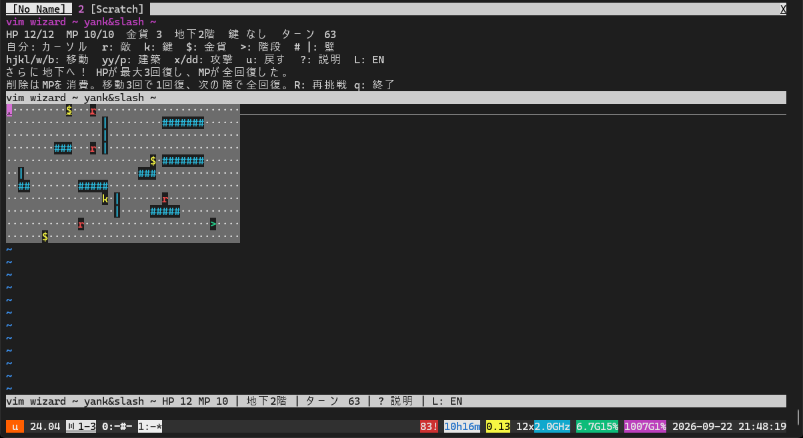

# vim wizard ~ yank&slash ~

[日本語の説明](README.ja.md) | English

A text-editing dungeon for Vim and Neovim. Your cursor is the wizard;
the dungeon is a real buffer. Rats chase you around editable walls. Yank a
fence and paste a barricade, slash open a route, or erase the exit by accident
and rewind time. Random floors continue indefinitely: see how deep you can go.



## Play

Clone the repository, then start the game from its directory:

```sh
git clone https://github.com/0x6d61/vim-wizard.git
cd vim-wizard
```

Start Vim or Neovim:

```sh
vim -Nu NONE -n --cmd 'set runtimepath^=.' -c 'runtime plugin/yank_and_slash.vim' -c VimWizard
# Or:
nvim -u NONE -n --cmd 'set runtimepath^=.' -c 'runtime plugin/yank_and_slash.vim' -c VimWizard
```

For an existing session, add this directory to `runtimepath`, run
`runtime plugin/yank_and_slash.vim`, then `:VimWizard`.
The old `:YankAndSlash` command still works. The title screen opens in a new
tab. Select **日本語** or **English** with `j` / `k`, the arrow keys, or
`1` / `2`, then press **Enter** to start. Nothing in the dungeon moves while
you choose a language. Japanese is selected initially; set
`let g:vim_wizard_language = 'en'` to preselect English.

The game has a separate read-only panel for HP, inventory, controls, and
messages. Help and game messages use your selected language. `L` switches
languages during play without spending a turn. `q` closes both game windows
and returns to your previous tab. Entering `:q` from a game, HUD, shop, or
help window quits Vim or Neovim entirely, subject to the usual unsaved-change
check. If another buffer has unsaved changes, the editor stays open.

`?` opens a scrollable shortcut guide in your selected language. It explains
movement, cutting, copying, pasting, and combinations such as `3w` and `2dd`.
A separate reference section covers normal Vim editing outside the game.
Use `j` / `k`, `Ctrl-d` / `Ctrl-u`, or `gg` / `G` to browse the guide;
`q` or Escape returns to the exact same game position without spending a turn.

## Combat feedback

Killing a rat with `x` or `dw` creates a brief spark. `dd` sweeps a slash
across the deleted row; multiple kills show a larger `3 KILLS!` banner.
Pasting walls with `p` or `P` flashes the new building material and announces
`WALL RAISED!`. The HUD records the total kills for the current run.

Effects last about 250 ms, or 400 ms for multi-kills, and never block the
next command. They are separate overlays, so their text cannot be yanked or
change the dungeon. Moving, undoing, restarting, opening help, or leaving
the game window clears an active effect. An attack rejected for insufficient
MP creates no effect and earns no kills. Undo also restores the kill count.

Set `let g:vim_wizard_effects = 0` to disable animation while keeping the
combat messages and kill count.

## Read the map

```text
·······················
····#######······r·····
··········|············
····$·····|············
··············k·······>
```

The highlighted cursor is you. Floor dots and spaces both display as `·`,
one tile per character. The cursor cell shows its original character so it
stays visible. Walls are cyan, rats red, treasure yellow, and stairs green.
The underlying map keeps its ASCII dots and word-separating spaces, so native
`w` / `b` motions still work; only their display changes. The HUD
is outside the map, so `gg`, `dd`, and `yy` cannot edit its labels.

## Rules

- `.` and spaces are floor; `#` and `|` are walls; `r` is a rat;
  `k` a key; `$` gold; and `>` the exit.
- Land on a key or gold to collect it. Reach the exit with a key to advance.
  There is no final floor. Each new floor raises both max HP and max MP by
  a random 1–9, heals 3 HP plus the HP gain, refills MP and shop stock,
  and resets the turn counter to zero.
- Every supported command costs one turn, including yank and unsuccessful
  motions. Counts such as `3w` count as one turn. Waiting for the target of
  `f` or `t` does not advance time; Escape cancels the pending find.
- After your command, each rat moves one character horizontally or one row
  vertically toward you along a shortest route around walls. Rats attack
  for 1 HP when on your tile or directly adjacent, after moving. They never
  move onto other rats, keys, gold, or exits. Unreachable rats wait.
  One rat spawns every 5 turns on a reachable floor tile at least 6 steps
  away. It starts moving on the following turn. Spawning stops at 24 rats,
  and the schedule resets on each new floor.
- Walls stop rats, but the wizard's native Vim motions can cross them.
  Standing on a wall is safe. Walls are durable in this prototype: `yy`
  and `p` can build cover, while `x`, `dw`, or `dd` can open paths through it.
- `x`, `dw` and `dd` really delete text and shift the remaining dungeon.
  `x` and `dw` consume MP based on the amount removed: 1 per 8 characters (including
  newlines), plus 1 per rat and 1 per 4 wall tiles, rounding each group up.
  A precise `x` on one rat costs 2 MP. `dd` costs a flat 8 MP per command,
  even with a count such as `5dd` or multiple rats. If MP is insufficient,
  the action is cancelled without changing the
  map, registers, or turn. The HUD shows the required MP.
  You start with 10 MP. Three successful ordinary movement commands restore
  1 MP, capped at your current maximum; failed moves, yanks, pastes, and
  character-search jumps do not recharge it.
  Moving one tile or using `3w` each counts as one movement command.
  A successful `f`, `F`, `t`, or `T` costs 1 MP regardless of distance.
  At 0 MP the jump still works, but rats move and attack twice that turn.
  An unsuccessful character search costs no MP.
  Deleted treasure is lost; deleted rats cannot attack. `yy`, `p`, and `P`
  use Vim's unnamed register. Pasted rats are alive, and pasted loot is real.
- `S` opens a shop without advancing time. Each floor stocks one HP potion
  (3 gold, +4 HP), one MP potion (3 gold, +5 MP), and one free-slash scroll
  (5 gold). The scroll makes the next non-empty MP-costing slash free.
  Press `1`/`2`/`3` to buy, or `q`/Escape to return. Yanking and pasting
  gold to collect more is allowed.
- `u` restores the previous board, enemy positions, cursor, HP, MP, inventory,
  numbered/unnamed/small-delete registers, and map generator state for free, even after death or a
  floor transition. Up to 100 turns are kept.
- Each 39-column, 11-row floor starts with random fences, 3 to 12 rats,
  three gold pieces, one key, and one exit. Generation carves a walkable route
  from the starting tile to the key and then the exit. Rats start at least
  nine terrain steps away. Rat counts grow with depth and cap at 12 so deep
  floors remain playable. `R` restarts with a fresh map at floor 1.

| Action | Keys |
| --- | --- |
| Move | `h j k l`, `w b e`, `0 ^ $`, `gg G` |
| Find a character | `f F t T` followed by a character; `; ,` repeat |
| Edit | `x dw dd yy p P` |
| Rewind / new random run / help / quit | `u` / `R` / `?` / `q` |
| Shop | `S` |
| Switch Japanese / English | `L` |

This prototype deliberately allows powerful edits, safe wall perches and
loot duplication; the first goal is to make editing the dungeon fun.
Only the listed commands are
integrated with turns. Other native navigation can bypass turns, so this is
not a competitive scoring system. Insert mode and arbitrary edits are blocked
by `nomodifiable`. Normal delete/yank commands affect your editor registers;
use the clean-session commands above when trying it out.

For reproducible layouts, set `let g:vim_wizard_seed = 42` before starting.
Restarting advances the generator; rewinding a floor transition and taking
it again recreates the same floor. The special-attack gauge is not implemented.

## Smoke test

```sh
vim -Nu NONE -i NONE -n -es -S tests/smoke.vim
vim -Nu NONE -i NONE -n -es -S tests/effects.vim
vim -Nu NONE -i NONE -n -es -S tests/teleport.vim
vim -Nu NONE -i NONE -n -es -S tests/spawn.vim
vim -Nu NONE -i NONE -n -es -S tests/shop.vim
vim -Nu NONE -i NONE -n -es -S tests/quit_game.vim
vim -Nu NONE -i NONE -n -es -S tests/quit_hud.vim
vim -Nu NONE -i NONE -n -es -S tests/quit_modified.vim
vim -Nu NONE -i NONE -n -es -S tests/j_movement.vim
nvim --headless -u NONE -i NONE -n -S tests/smoke.vim
nvim --headless -u NONE -i NONE -n -S tests/effects.vim
nvim --headless -u NONE -i NONE -n -S tests/teleport.vim
nvim --headless -u NONE -i NONE -n -S tests/spawn.vim
nvim --headless -u NONE -i NONE -n -S tests/shop.vim
nvim --headless -u NONE -i NONE -n -S tests/quit_game.vim
nvim --headless -u NONE -i NONE -n -S tests/quit_hud.vim
nvim --headless -u NONE -i NONE -n -S tests/quit_modified.vim
nvim --headless -u NONE -i NONE -n -S tests/j_movement.vim
```

Tests cover title-screen language selection, Japanese/English messages,
generated-map reachability, native key mappings, pursuit, wall
detours, building/removing walls, pasted enemies, ragged/empty maps, undo,
repeatable floor transitions, MP costs/recovery/rollback, floor 1000,
death, and window cleanup.
The effects tests also check timer cleanup, uninterrupted input, multi-kill
counts, cancelled attacks, and unchanged map/register contents during animation.
No external dependencies are required. Animation uses Vim popup windows or
Neovim floating windows; text feedback still works without popup support.

## License

[MIT](LICENSE) © 2026 0x6d61.
